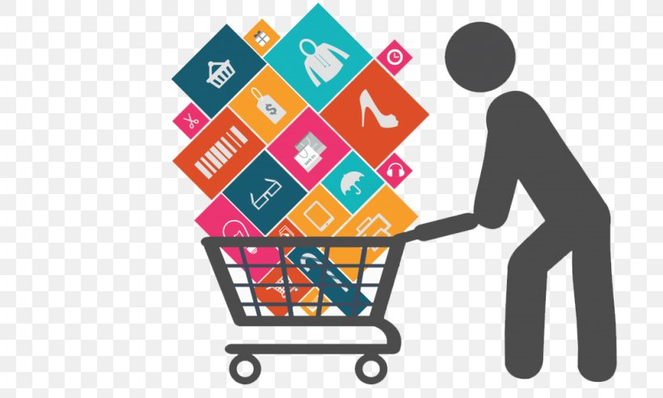

# 🛒 Retail Sales Analysis | SQL Project 📊

Welcome to the **Retail Sales Analysis Project**, where I explored a rich retail dataset using **SQL** to uncover valuable insights, identify business trends, and answer key questions. This project focuses on leveraging SQL queries to solve real-world business problems.

## 🍽️ Project Overview

In this project, I focused on the following:

- **Data Cleaning**: Removed missing or irrelevant data to ensure the dataset's accuracy and reliability.
- **Exploratory Data Analysis**: Explored key metrics like total sales, unique customers, product categories, and customer demographics.
- **Business Insight Generation**: Answered business-critical questions to derive actionable insights, such as top-selling products, customer behavior, and sales trends.
- **Advanced Query Techniques**: Utilized complex SQL techniques such as **window functions**, **CTEs**, and **aggregation** to answer high-level business questions.

## 🧑‍💼 Key Business Questions Answered

Here are the critical SQL queries used to solve business problems:

1. **Retrieve all columns for sales made on '2022-11-05'.**  
2. **Find transactions where the category is 'Clothing' and quantity sold is more than 10 in Nov 2022.**  
3. **Calculate total sales for each product category.**  
4. **Find the average age of customers who purchased items from the 'Beauty' category.**  
5. **Identify transactions where total sales exceed 1000.**  
6. **Analyze the total number of transactions (transaction IDs) by gender for each category.**  
7. **Calculate the average sales for each month and identify the best-selling month each year.**  
8. **Find the top 5 customers based on the highest total sales.**  
9. **Find the number of unique customers who purchased items from each category.**  
10. **Classify orders into shifts (Morning, Afternoon, Evening) based on sale time and count the number of orders in each shift.**

## 🚀 Insights & Solutions

### 🔥 Key Insights Generated
- **Sales Trends**: Identified the highest-grossing months and products, helping businesses focus on peak times.
- **Customer Insights**: Pinpointed top customers and their purchasing patterns, aiding targeted marketing campaigns.
- **Category Performance**: Analyzed performance across different product categories and identified best sellers.
- **Shift Analysis**: Segmented sales based on time of day (Morning, Afternoon, Evening), providing insights into sales patterns throughout the day.

## 💬 How I Can Help Your Business

This analysis not only answered fundamental business questions but also provided a foundation for decision-making. Whether you are looking to optimize product categories, improve customer targeting, or gain insights into sales patterns, **SQL-powered insights** can unlock the potential for growth.

## 📧 Connect with Me

- **Email:** [arundeepp@gmail.com](mailto:arundeepp@gmail.com)  
- **LinkedIn:** [linkedin.com/in/arun](https://www.linkedin.com/in/arun)  
- **GitHub:** [github.com/ArunCooksData](https://github.com/ArunCooksData)  

---

**Let’s Cook Data Together and Serve Powerful Insights! 🍳📊**

